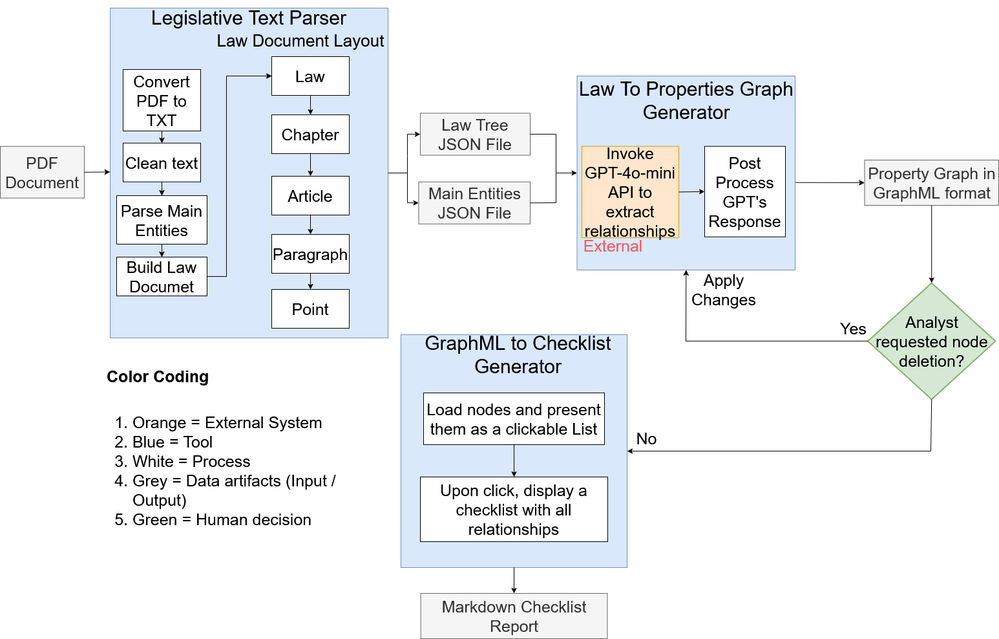

# ChatGPT_Law_PropertyGraph: Automated Analysis of Regulatory Documents

## Overview

**ChatGPT_Law_PropertyGraph** is a modular Java-based software pipeline that transforms legal PDF documents into structured knowledge, supporting compliance checking with the European data regulatory framework. The system produces:

- A **property graph** in GraphML format  
- A **Markdown checklist** outlining obligations, rights, and prohibitions

This project was developed as part of a thesis and uses the **EU AI Act** as a primary use case.

---


> High-level architecture of the legal document analysis pipeline.

## Project Structure

The repository consists of **three independent Maven projects**, each located in its own subdirectory:

```
/LegislativeTextParser  
/LawToPropertyGraphGenerator  
/GraphMLToChecklist
```

### Components at a Glance

- **LegislativeTextParser**: Extracts and cleans legal text from PDF files, preserving legal structure (Law → Chapter → Article → Paragraph).
- **LawToPropertyGraphGenerator**: Uses a Large Language Model (GPT-4o-mini) to extract legal entities and relationships, producing a property graph.
- **GraphMLToChecklist**: Generates a Markdown checklist summarizing legal responsibilities.

---

## Pipeline Components

### 1. Legislative Text Parser (`/LegislativeTextParser`)

- Parses and cleans legal PDF documents.
- Extracts hierarchical structure: **Law → Chapter → Article → Paragraph**.
- Outputs:
  - `law_structure.json`
  - `entities.txt` to: `src/resources/output/entities.txt`

---

### 2. Law-to-Property-Graph Generator (`/LawToPropertyGraphGenerator`)

- Uses **OpenAI GPT-4o-mini** to extract legal entities and their verbal relations.
- Applies Levenshtein distance for entity normalization.
- Constructs a unified **property graph**.

#### Required Setup

- Create a file named `env.properties` in the root of this project with the following content:

  ```
  GPT_API_URL=https://api.openai.com/v1/chat/completions
  GPT_API_KEY=your_openai_key_here
  ```

- Copy `entities.txt` from the first project's output:

  ```
  From: /LegislativeTextParser/src/resources/output/entities.txt  
  To:   /LawToPropertyGraphGenerator/src/resources/output/entities.txt
  ```

- Output:
  - `final.graphML` in `src/resources/output/`

---

### 3. GraphML-to-Checklist (`/GraphMLToChecklist`)

- Loads the GraphML file into a **JavaFX** interface.
- Generates a **Markdown checklist** summarizing the graph nodes.

#### Usage Note

- On startup, load the following files:
  - GraphML:  
    `/LawToPropertyGraphGenerator/src/resources/output/final.graphML`
  - JSON:  
    Output from `/LegislativeTextParser` (e.g. `law_structure.json`)

---

## Example Workflow

```bash
# 1. Run the legislative parser
cd LegislativeTextParser
mvn clean install
java -jar target/legislative-text-parser.jar

# 2. Copy the entities file to the second tool
cp src/resources/output/entities.txt ../LawToPropertyGraphGenerator/src/resources/output/

# 3. Add API credentials to env.properties in the second tool's root
# Create a file named "env.properties" in the project's root
# Paste inside :
GPT_API_URL=https://api.openai.com/v1/chat/completions
GPT_API_KEY=your_openai_key_here

# 4. Run the property graph generator
cd ../LawToPropertyGraphGenerator
mvn clean install
java -jar target/law-to-property-graph-generator.jar

# 5. Start the checklist generator and load the required files
cd ../GraphMLToChecklist
mvn clean install
java -jar target/graphml-to-checklist.jar
```

---

## Technologies Used

- Java 21  
- Maven  
- JavaFX  
- OpenAI GPT-4o-mini API  
- GraphML (yEd-compatible)  
- JSON & Markdown

---

## Authors

Developed by **Papadopoulos Konstantinos**,  
Undergraduate student, **Department of Computer Science and Engineering**,  
**University of Ioannina**

Supervised by **Professor Panos Vasiliadis**
